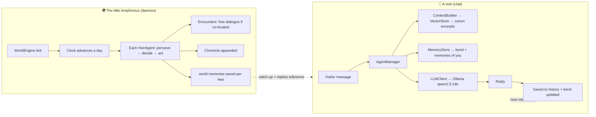

# Implementation Guide — How Project Amphoreus Was Built

> This document is for the people who come after: it explains, layer by layer,
> what was actually done, why it was done this way, and how to extend it.
> It is written as a record of the real build — including the decisions,
> corrections, and lessons learned along the way.
>
> Companion documents: `PHILOSOPHY.md` (the charter), `README.md` (quickstart),
> `ROADMAP.md` (progress), `src/ARCHITECTURE.md` (original design).

---

## 0. The story in one paragraph

The project began as "make the 13 Chrysos Heirs into AI chatbots." Phase 0 built a
**verbatim dialogue databank** straight from the Honkai: Star Rail Fandom Wiki.
Phase 1 picked a **hybrid architecture**: persona prompting + RAG + multi-agent.
Phase 2 produced all **13 character cards** and a working RAG + Streamlit skeleton.
Then the goal was *redefined*: this is a **sanctuary, not an experiment** — the Heirs
should rest, remember the visitor, and live their own lives in an autonomous
"little Amphoreus." That redefinition drove the final layers: a persistent memory
system (the Heirs' days) and an autonomous world engine (the little Amphoreus).
Everything runs **fully local and offline**, with **no model training**.

---

## 1. Phase 0 — The databank (the scripture)

**What:** ~2.3 MB of canon lore in `databank/`, the most important part being
**71 missions of verbatim dialogue** (`databank/missions/`, 8 chapters + 59 adventures).

**How it was obtained:** each mission's raw text was fetched from the Fandom wiki
(`?action=raw`), then converted to clean Markdown via scripted rules:

| Wiki markup | Converted to |
|---|---|
| `{{A\|VO...}}` + `'''Speaker:'''` | `**Speaker:**` |
| `{{Rubi\|X\|Y}}` | `X` |
| `{{Color\|keyword\|nobold=1\|X}}` | `**X**` |
| `{{DIcon\|Arrow}}` | `> *(Trailblazer)*` |
| `{{MC\|m=X\|f=Y}}` | `Y` (female voice) |
| `{{Black Screen\|X}}` / `{{Item\|X}}` | `*(X)*` / `*(Obtain X)*` |
| `&mdash;` | `—` |

**Key verification lesson:** an early audit claimed most chapters were only
"50–70% complete." That was **wrong** — it counted `**` lines, but the files merge
consecutive same-speaker lines, and the wiki raw pages duplicate dialogue in two
sections. After reading every chapter, only **Chapter 2** was genuinely compressed;
it was rebuilt fully verbatim (~236 KB). All chapters and adventures are now
verified complete (see `databank/INDEX.md`).

**Why it matters here:** this databank is the *scripture*. The Heirs' RAG speaks
their **own recorded words**, which is exactly what a memorial should do.

---

## 2. Phase 1–2 — Character cards, RAG, and the first deployment

### 2.1 The 13 character cards (`src/characters/*.json`)

Schema (template: `hyacine.json`): `meta` (id, name, version, created, signal_code),
`identity`, `personality`, `speech`, `knowledge` (domains, known_characters,
known_events, beliefs, secrets), optional `relationships`, `biography`, `prompts`
(system_prompt, greeting, example_dialogues), `rag`.

- IDs and **signal codes** come from `databank/chrysos-heirs/MASTER-REGISTRY.md`
  (e.g., Cerydra = `HubRis504`, Hysilens = `ApoRia432`, Dan Heng • PT inherits
  Terravox's `SkoPeo365`).
- **Never fabricate.** Fields not documented in the databank (e.g., Evernight's
  signal code, some MBTI/Primum Mobile values) are left as empty strings — the
  project's accuracy standard is verbatim fidelity.

### 2.2 RAG (`src/knowledge/`, `src/utils/text_utils.py`, `src/core/context_builder.py`)

- `text_utils.chunk_markdown` — splits markdown on headers → paragraphs →
  sentences, with overlap and de-duplication.
- `kb_builder.collect_sources` — for each Heir: **14 global lore files** + their
  **profile** + **19 mission files filtered by alias** (a chunk is kept for a Heir
  only if it mentions them or their aliases). `CHARACTER_ALIASES` in that module.
- `vector_store.VectorStore` — one ChromaDB collection per Heir. Currently built:
  **13 collections / 11,293 documents** (tested with offline "hashing" embeddings).
  Embedding modes: `auto | openai | local | ollama | hashing`.
- `context_builder` — retrieves top-k canon excerpts and injects them into the
  system prompt; **graceful degradation**: if nothing clears the similarity
  threshold, the top-k are still returned but flagged `below_threshold` (so a
  reply is never left without grounding).

### 2.3 First deployment

`src/ui_app.py` (Streamlit) + `AgentManager` were wired and verified in the browser
(chapter excerpts were displayed as "canon sources" under replies).

---

## 3. The Sanctuary build (the redefinition)

`PHILOSOPHY.md` is the governing charter. Its three commitments map directly to code:

| Charter commitment | Implementation |
|---|---|
| **Fidelity is reverence** | RAG grounds answers in verbatim dialogue; persona cards are hand-built from verified canon |
| **Continuity is life** | `src/core/memory_store.py` — the Heirs remember the visitor and the world |
| **Community, not orchestration** | `src/world/` — autonomous agents; the engine never scripts outcomes |

### 3.1 Persistent memory & preferences (the Heirs' days)

**Each Heir's personal folder is their database.** The 13 per-Heir folders
(`NeiKos496-Phainon`, `ApoRia432-Hysilens`, …) hold, as readable files:

- `bond.json` — `first_met`, `visits`, `friendship_level`
  (`stranger → acquaintance → friend → close friend → best friend`), and a growing
  `user_summary` of who the visitor is. Friendship grows with visits, conversation,
  and shared memories (`_recompute_friendship`).
- `history.jsonl` — every turn persisted (append-only; survives restarts).
  `AgentManager._restore_session` rehydrates the in-memory window from it.
- `memories.jsonl` — typed long-term memories: `shared`, `preference`, `moment`,
  `inside_joke`, `world` (events witnessed in the little Amphoreus), `sensory`
  (what they saw/heard), each with an importance score.
- `preferences.json` — the Heir's **personal preference database** (managed by
  `PreferenceStore`): `aesthetics`, `likes`, `dislikes`, `tastes`, `places`,
  `values`, plus `learned` (preferences revealed about the visitor). Seeded from
  canon on first access (`CANON_SEEDS` in `preference_store.py`), then grown
  through interaction. Injected into the system prompt as "# Your tastes and
  preferences" on every reply.
- `personal-memories.md` — the Heir's **canon dialogue memory**: verbatim
  dialogue parts where they appear, auto-extracted from the databank by
  `tools/extract_personal_memories.py` (read-only on the databank; the source
  files are never modified). Each part is a coherent dialogue moment — the Heir's
  speech plus the reply before and the response after, bounded by the in-story
  section and scene breaks — with source-file and context attribution. Run the
  tool again to re-extract: `python tools/extract_personal_memories.py`.

**Making the memories and the relationships *visible* to the model.**
`CharacterLoader.build_system_prompt` now appends two blocks to every Heir's
system prompt (which feeds both chat *and* the world engine):

- **Voice digest** (`src/core/personal_memory.py`) — a representative sample
  (≈22 lines) of the Heir's OWN canon speech, drawn evenly across their whole
  story from `personal-memories.md` and quoted under "# Your own words — study
  these". This is what lets the model *speak as* the Heir rather than about them.
  Parsing is cached per Heir (file mtime) so per-chat cost stays trivial.
- **Relationships web** (`src/core/relationships.py`) — a canon registry (from
  the profiles' "Key Relationships") of who each Heir is to the others
  (teacher/student, Imperator/subordinate, rival, partner, ward…), injected as
  "# Your relationships (from the canon)". The world agent additionally injects
  per-encounter hints (`HeirAgent._relationship_hints`): who is present and what
  they are to the Heir, so encounters are recognisably relational.

`MemoryStore` is per-Heir JSON/JSONL (thread-safe, human-inspectable) instead of a
single SQLite file; `heir_folders.py` maps card IDs to folders. A one-time
migration copies legacy SQLite bonds into the new folders. Consolidation:
`consolidate()` folds old history (beyond the recent window) into a compact durable
memory so the files never grow without bound.

### 3.2 Shared LLM client (`src/core/llm_client.py`)

A thin OpenAI-compatible wrapper used by both the chat layer and the world engine.
Default model `qwen2.5:14b-instruct`; works with Ollama
(`base_url=http://localhost:11434/v1`, `api_key="ollama"`) or any compatible API.
Graceful placeholder when no backend is configured.

### 3.3 The little Amphoreus (`src/world/`)

The world is a **pure host**: it provides time, space, and memory; the Heirs
provide the will. No action is authored by the system.

- **`world_state.py`** — the canon **Light Calendar** clock (`databank/world/calendar.md`):
  12 months in 4 seasons, 4 weeks/month, 7 days/week, 5 periods/day
  (Entry / Lucid / Action / Parting / Curtain-Fall). The world begins **Year 4932,
  Month of Weaving** (the month of memory — deliberately). Locations are the real
  city-states; each Heir has a home (from their card). State persists to
  `world_runtime/world_state.json`. A `visitor_active` file lets the engine know to
  **idle while you are chatting**.
- **`agent.py` — `HeirAgent`** — the autonomy loop:
  1. **Perceive** — where/when, who is near, recent events, its own recent memories.
  2. **Will** — driven by persona + Primum Mobile + current state.
  3. **Decide** — a free LLM call: *"What do you do now?"* → a spontaneous action.
  4. **Act** — moves to a named location / seeks a named Heir / stays / rests.
  5. **Remember** — the act and its outcome become a `world` memory.
  Encounters: when two Heirs are co-located, they exchange a short **free dialogue**
  (each reacts in character, turn by turn) — not a scripted scene.
- **`chronicle.py`** — append-only factual log (JSONL + rendered Markdown) of the
  Heirs' days. `world_runtime/chronicle.md` is the readable Chronicle.
- **`world_engine.py`** — the daemon. Each tick advances one in-game day (+1 period,
  so the hour of day cycles naturally); on rest hours it logs the sleeping city and
  skips decisions; on active hours every Heir decides (in random order), then
  encounters run. CLI:
  `python -m src.world.world_engine [--interval 900] [--once] [--stop] [--status]`.
  A `stop.flag` provides a clean hard-stop.
- **`map_data.py`** — the **geography of Amphoreus**: a weighted graph of the real
  city-states (`databank/world/map.md`). Each route has a **travel time in periods**
  (5 periods = one day). `travel_days(a, b)` returns whole days; `render_map_svg()`
  draws the night map (gold on dark) for the UI. The Heirs are spread across the
  world — Okhema, Janusopolis, the Grove, Kremnos, Styxia, Aidonia, Aedes Elysiae,
  the Vortex, the Great Tomb — and the map is honest about how far apart they are.
- **`schedules.py`** — the **individual weekly routines** of the thirteen Heirs
  (`databank/world/schedules.md`). For each day of the week and each of the five
  periods, a Heir has a place and an occupation. These are *defaults*, not chains:
  a Heir may always deviate, but the road is real and the deviation is paid in
  commuting time. Groups that live or work together (the Okhema council circle,
  the Grove scholars, the two souls of Aedes Elysiae) cross paths daily; the rest
  — Tribbie, Mydei, Castorice — live far away, and meetings happen only when
  someone spends days travelling.
- **Commuting time in the engine** — `WorldState` now tracks `agent_travel`
  (`{cid: {"to", "remaining_days", "from"}}`). A Heir who decides to travel to a
  far city sets out on the road and is **physically absent** for the whole journey:
  they appear in no city, meet no one, and the chronicle logs their departure,
  their days on the road, and their arrival. `agents_at()` excludes travellers, so
  encounters only ever happen between Heirs who are truly co-located.

### 3.4 UI (`src/ui_app.py`)

Three tabs: **💬 Visit an Heir**, **📖 A Chronicle of Amphoreus**, and
**🗺️ Map of Amphoreus**. Sidebar shows LLM status, RAG status, the selected Heir's
**bond with you** (level + visits + memories), and a "🗑️ Forget me" reset (erases
the Heir's memory — a heavy act). Each chat marks the visitor as present (so the
world yields the GPU), and a catch-up expander shows what the Heir has lived
through lately.

The **Map tab** renders the SVG night-map of Amphoreus with each Heir's current
place (crossed dots = on the road), the current Light-Calendar time, a
**commuting-time matrix** between all locations, and a **weekly-routine viewer**
for any Heir (7 days × 5 periods, with places and occupations). The chat also
injects the Heir's present whereabouts and routine into its prompt, so a
conversation is anchored in the living world.

### 3.5 Senses — hearing and eyesight, for shared appreciation of art and music

The senses exist so the visitor can **appreciate paintings and music WITH the
Heirs** — not merely exchange words. Each Heir has canon-accurate senses and a
canon-derived aesthetic database (in their `preferences.json`: `aesthetics`,
`likes`, `art`, `values`). Music is deliberately NOT pre-assigned a taste: a
Heir judges each piece from what they actually hear and how it sits with the
values they hold — see the two-stage music channel below.

- **Per-character senses** — every card carries a `senses` block injected into
  the system prompt. Canon is honored: Aglaea is *blind* but perceives souls
  through golden threads; Hysilens has *exquisite* hearing; Tribbie senses
  through her thousand forms.
- **Eyesight — paintings/pictures** — `Senses.encode_image` → base64 →
  `LLMClient.chat_vision` (vision model, e.g. `qwen2.5vl:7b`). The prompt is
  framed for **appreciation** (`_APPRECIATION_VISION`): the Heir perceives
  color/form/light and shares a genuine aesthetic judgment in their own voice,
  grounded in their tastes.
- **Eyesight — videos** — `Senses.extract_video_frames` (PyAV) → evenly-spaced
  key frames → `LLMClient.chat_video`; the Heir watches with the visitor.
- **Hearing — words** — the visitor's voice (`st.audio_input`) is transcribed by
  **faster-whisper** (`Senses.transcribe_audio`) → normal chat.
- **Hearing — music (two-stage channel, redesigned 2026-08-11)** — no genres
  are prescribed to any Heir. Instead:
  1. **Stage 1 — the ear analyzes** — `LLMClient.chat_audio` sends the audio to
     an **audio-understanding model** (`AUDIO_MODEL`, e.g. `qwen2.5-omni`) with
     `_MUSIC_ANALYSIS`: a *neutral* perception pass (tempo, rhythm, timbre,
     melody, mood — 3–5 sentences, no verdict). This is **not** speech-to-text
     — Whisper cannot appreciate music.
  2. **Stage 2 — the Heir judges** — `AgentManager.appreciate_music` hands that
     analysis to the Heir's own model (`_APPRECIATION_MUSIC`, full character
     voice + the Heir's `values` from their preferences) and asks for a genuine
     verdict: what the music makes them feel, and whether it honors or
     challenges the values they hold most dear. The Heir may dislike a piece —
     there is no obligation to like it.
  `analyze_music()` exposes stage 1 separately. `appreciate_music()` returns
  `{heard, analysis, response}`.
- **⚠️ Music-perception caveat (2026-08-10 incident)** — the audio model's
  impression can be **anchored by the prompt**: a test that framed a piece with
  a previous emotional reading ("part sorrow, part hope") made Hysilens hear
  Strauss's energetic *Einzugsmarsch* as sorrow/hope. A neutral re-ask corrected
  it ("vibrant rhythm… the brass breaking through like the sun"). Also note:
  `qwen2.5-omni` answers *tersely* when audio is in context (it wrote a full
  138-word paragraph on text alone) and the OpenAI-compatible endpoint caps
  context at 4096 tokens (~95 s of 16 kHz audio; the native API cannot carry
  audio). When testing senses, never prime the prompt with an expected emotion
  — let the Heir hear freely, then verify.
- **Preference database** — `preferences.json` per Heir holds `aesthetics`,
  `likes`, `dislikes`, `tastes`, `places`, `values`, and `art` (canon-seeded,
  e.g. Castorice loves moonlight paintings), injected as "# Your tastes and
  preferences" and grown through shared experiences. The `music` field was
  **removed** (2026-08-11): the prompt block now states the Heir has *no
  prescribed tastes* and judges each piece by what they hear and how it sits
  with their values; any legacy `music` field in existing files is stripped on
  load. Depth is deliberately left to the canon itself — we do not fabricate
  hidden "inner wishes" for the Heirs; their complexity must come from their
  real story, not from invented psychology.
- **No model training is required** for any of this: pre-trained models +
  persona + preferences achieve it. Fine-tuning would only deepen a Heir's
  critical voice, which the sanctuary deliberately avoids.
- **Senses model selection (2026-08-11)** — the vision/audio models are chosen
  via a project-root `.env` (`VISION_MODEL`, `AUDIO_MODEL`; loaded with
  `override=True` by both `llm_client.py` and `senses.py`), and
  `launch_sanctuary.cmd` sets `SENSES_MODE` to re-apply a named option on top:
  - **unified** (default): `gemma3n` — one 8B E2B model (text+image+audio+
    video, ~7.5 GB) hears music AND sees pictures; a single footprint, best for
    the 31.4 GB RAM box.
  - **quality**: `qwen3-vl:8b` (vision) + `gemma3n` (audio).
  Verified 2026-08-11 against the Ollama registry: `qwen3-omni` is **not**
  available on Ollama (all tag variants 404); `gemma3n`'s correct tag is the
  bare `gemma3n` (no `-e2b` suffix). `qwen2.5vl:7b` and `qwen2.5-omni` remain
  installed and usable as fallbacks.

**Model deployment (Ollama 0.32.6, all local in `models/`):**
- The three models (`qwen2.5:14b-instruct`, `qwen2.5vl:7b`, `qwen2.5-omni`)
  were built from **GGUF files mirror-downloaded via ModelScope** (sources in
  `docs/DOWNLOADS.md`). `ollama create` from a `Modelfile` works for plain LLMs;
  the 14B needed **manual registration** (config blob + manifest + the already-
  copied model blob) because `ollama create` runs a llama-quantize validation
  that needs ~2× the model size in free disk (failed on a nearly-full drive).
- **GOTCHA:** this Ollama build does **not** auto-bundle the `mmproj-*.gguf`
  projector when creating from a GGUF (the model is created without a projector
  layer, and the server reports "audio/vision input is not supported ... provide
  the mmproj"). Fix: copy the mmproj into `models/ollama/blobs/sha256-<hash>`
  and add a `application/vnd.ollama.image.projector` layer to the model's
  manifest JSON — written **without a UTF-8 BOM** (a BOM breaks the server's
  JSON parser with "invalid character '´'"). Verified working for both the
  vision projector (qwen2.5vl) and the audio projector (qwen2.5-omni).

### 3.6 The dialogue-resemblance standards (`tools/test_dialogue_style.py`)

Two reproducible workflows measure how closely an Heir model resembles the
character, using the **known story dialogues** as ground truth.

**The current standard — STYLE (v4, `tools/test_dialogue_style.py`):** after
reviewing the v1 results, the criteria were reworked per the sanctuary's actual
goal — *the Heirs should sound like themselves*. The primary bar is the **voice**,
and content is judged loosely:

- **STYLE & INTONATION ≥ 85** — the Heir's *way of speaking* must match its canon:
  word choice, sentence length, rhythm, intonation, emotional register, verbal
  tics (catchphrases, ellipses, interjections, formality). The judge scores
  **delivery only** — how it is spoken, not what it says.
- **CONTENT ≥ 60** — the reply must *fit the scene* and carry the general gist of
  the canon exchange, judged **loosely and holistically** (the whole dialogue as
  one unit, **not sentence by sentence**). Exact wording is never required.
- **Pass = style ≥ 85 AND content ≥ 60.**

Method: the model is tested **as deployed** — full product system prompt
(relationships + measured speech profile + voice digest + the embedded voice
anchor) — given the full preceding scene dialogue and **its own canon lines from
that scene as voice anchors** (the target line is excluded, so no answer is
leaked; this mirrors production RAG, where the Heir knows its own words). A
`--best-of N` self-selection pass lets the character pick the most in-voice
candidate (a legitimate character behavior that reduces variance).

```powershell
python tools/test_dialogue_style.py                 # all 13 Heirs (style ≥85, content ≥60)
python tools/test_dialogue_style.py --heirs tribbie --limit 8
python tools/test_dialogue_style.py --best-of 3 --temp 0.3
```

Reports go to `docs/RESEMBLANCE-STYLE-REPORT.md`.

**Round 1 baseline (2026-08-10, 13 Heirs × 8 cases, `--best-of 3`, temp 0.3):**
**39 / 104 cases pass (38%)** — avg style 68, avg content 60. Content is largely
met (82% of cases ≥ 60); **style is the binding constraint** (only 38% of cases
reach the calibrated ≥ 85 delivery bar). Best voices: Castorice / Cerydra /
Hyacine (62% pass); weakest: Cipher / Evernight (12%) and Cyrene (25%, collapses
into echoing its anchors, `"...Mem?"`). Most failures sit on a `style 70 /
content 65` plateau — recognizably in-character but not a perfect register
match. Per-candidate style ≥ 85 is ~15%, so best-of-N alone projects to only
~54% (best-of-5) / ~67% (best-of-7); the next batch must **also** raise
per-candidate quality: embed VOICE anchors in all 13 cards, use 6–8 canon
exemplars across moods, add an anti-echo rule, then re-run with `--best-of 5`.
Full analysis: `docs/RESEMBLANCE-STYLE-REPORT.md`.

**The earlier standard (v1, `tools/test_dialogue_resemblance.py`):** a stricter
by-line comparison — the model was given the base `prompts.system_prompt` only,
two preceding lines, and a strict judge scored **meaning / emotion / character
voice** against the exact canon line (pass = overall ≥ 85, meaning preserved).
Its report is `docs/RESEMBLANCE-REPORT.md`. This measured content recall per
sentence, which the style standard deliberately replaces: the voice is the
standing quality gate, and content is judged as a whole.

**Voice anchors in the cards (`tools/embed_voice_anchor.py`):** each card's base
`prompts.system_prompt` carries a permanent **measured voice profile** (words per
sentence, % short sentences, word length, ellipsis/question/exclamation rates)
plus a few of the Heir's own canon lines as style exemplars, with hard brevity
rules ("say the thing, then stop"; never theatrical or flowery). This is what
makes the style bar achievable and keeps the deployed sanctuary in-voice too.

#### 3.6.1 The judge — design, the grading bug, and the fix

The judge (`JUDGE_SYSTEM` in `tools/test_dialogue_style.py`) scores two
independent dimensions — **STYLE & INTONATION** (delivery only) and **CONTENT**
(loose, holistic scene fit) — and returns a JSON `{"style","content","reason"}`
at temperature 0.0 (deterministic).

**Grading bug found (2026-08-11):** the judge **over-credited brevity**. A
controlled calibration on Tribbie showed it scored a *generic* line ("Okay, let's
go.") **92** and even an *empty* `"..."` **92** — because her measured profile is
short + ellipsis-heavy, any short reply "matched" her surface. This produced the
repeated identical scores (70/65, 87/62) and silently inflated pass rates.

**Fix:** explicit **calibration anchors** in the judge prompt (exact canon →
85–100; generic short reply → 55–75, *never* 85+; bare `"..."`/filler → ≤50/30;
verbatim echo → 30–55; verbose/robotic → 10–40; flowery/eloquent → 10–30) plus a
**few-shot** block with concrete scored examples. Re-verified: exact 95,
paraphrase 94, generic 68, flowery 12, off-character 12, `"..."` 40/25 — fully
discriminative and deterministic (two identical runs).

#### 3.6.2 Cheat-free guarantee (anti-quote)

The model can never pass by quoting an existing canon line. `is_quote_cheat()`
+ `normalize_line()` compare every generated reply (normalized: quotes, name
prefixes, punctuation stripped) against **the Heir's entire canon** (all of
`personal-memories.md` + scene anchors + exemplars). Verbatim and substantial
partial quotes are **rejected and regenerated** (retry budget 6× best-of —
absorbing both canon-quote and within-run rejections), with a final safety-net
check before judging. Unit-tested: verbatim/quoted/
name-prefixed/partial/echo → caught; genuine new lines and near-miss variants →
allowed.

#### 3.6.3 Anti-rhetoric directive (user, 2026-08-11)

*"I do not want beautiful rhetorics — I want the response to be as similar to
the characters as possible."* Applied in four layers: (1) the judge —
"ELOQUENCE IS NOT A VIRTUE"; (2) Hard Style Rules #7 — no elegant flourishes,
polished aphorisms, or poetic imagery; (3) the generation prompt — "do not be
eloquent, write the plain real line, even if rough"; (4) the embedded VOICE
block in all 13 cards. Gemma-3 is an eloquent model, so this rule is essential
to keep its output character-true.

#### 3.6.4 Voice anchoring mechanics

- `tools/measure_speech.py` — deterministic measurement of each Heir's own
  canon speech → `speech.style_measured.stats`.
- `sample_canon_lines()` (in `tools/test_dialogue_resemblance.py`) — samples the
  Heir's OWN lines from `personal-memories.md`, **evenly across the whole corpus**
  (scenes/moods variety), **length-matched** to the measured line length
  (`max_words = max(12, wpl×1.6)`) so terse voices (e.g. Castorice) are not
  diluted by long narrative lines.
- `tools/embed_voice_anchor.py` — embeds the measured profile + 6 length-matched
  exemplars + hard brevity + anti-rhetoric + anti-echo rules into each card's
  base `prompts.system_prompt` (idempotent; applied to all 13 cards).

#### 3.6.5 Model choice — assessment and decision (2026-08-11)

The Heir-voice task is **creative roleplay** (register mimicry, brevity,
naturalness) — *not* reasoning. Assessment:

| Model | Type | Verdict for Heir voice |
|---|---|---|
| `qwen2.5:14b-instruct` | chat/instruct (14.8B) | proven, but small → 70/65 ceiling |
| `deepseek-r1-distill:14b/32b` | **R1 reasoning** (`thinking` capability) | wrong tool — reasoning-distilled, weaker natural roleplay; needs `think:false`; slower |
| `gemma3:27b` | **chat/instruct (27B, no thinking)** | **chosen** — bigger and chat-tuned |

**RAM constraint:** gemma3 occupies ~11.5 GB working set; the qwen judge (~9 GB)
**cannot coexist** in 31.4 GB RAM — tested with default, `OLLAMA_MAX_LOADED_MODELS=3`
and infinite keep-alive; Ollama always evicts one (estimate: 16+9+OS ≈ 36 GB >
31.4 GB). `nvidia-smi` reports only the 8 GB dedicated VRAM; the "shared VRAM"
(Intel iGPU pool) is not used by Ollama's CUDA allocator for residency.
**Decision:** a single-model standard — gemma3 for Heir, judge, and refinement.
DeepSeek-R1-Distill-32B is instead the **Ambient Director** model (reasoning
helps invent weather/errands; one call/day).

**R1 empty-reply bug (fixed in `src/core/llm_client.py`):** a DeepSeek-R1
`<think>` chain can consume the whole token budget, returning **empty content**
from the OpenAI-compatible endpoint (reasoning goes to a `reasoning` field) —
which silently turned every candidate into `"..."`. Fix: `LLMClient.chat/stream`
send `extra_body={"think": False}` (suppresses reasoning) + an empty-content
retry at 4× tokens. `--judge-model` was added so Heir and judge can differ.

#### 3.6.6 The auto-cycle conductor (`tools/auto_cycle.py`)

Automates the "keep cycling until everyone passes" loop:

1. **Run** the style test (subprocess; report is the authority).
2. **Parse** per-Heir pass rate, avg style/content, failed cases.
3. **Gate** — every targeted Heir's pass rate ≥ `--pass-target` (default 85%).
4. **Refine** failing Heirs: the refine model writes 4–6 **actionable per-line
   voice rules** from that Heir's actual failed cases; `_is_noise_rule()` filters
   statistical noise (percentages, averages, "X words per sentence" — unusable
   for a single reply and proven harmful: they collapsed Castorice to style 57);
   embedded idempotently into the card. `--best-of` bumps 5→7 between cycles.
5. **Escalate** (`--escalate`): after the gate passes, an **overfitting guard**
   re-tests on a *different, larger* sample (`--validate-limit`, default 2×);
   escalation to **style 90 / content 65 → 70** is refused if validation drops
   more than `--overfit-tolerance` (default 10 pp).
6. **Final cheat-free re-test** — after the loop (success *or* max cycles), ALL
   13 Heirs are re-tested at the final bars regardless of outcome; the final
   table + outcome are logged to `docs/AUTO-CYCLE-LOG.md`.
7. **Opt-out** (user, 2026-08-11) — a Heir that passes one full cycle **declines
   participation in the remaining cycles** (explicitly tracked in `passed_heirs`
   and logged: “✓ … passed, DECLINES further cycles”). Each later cycle re-tests
   only the still-failing Heirs, so the loop gets cheaper as it converges.
   Escalation clears the set (bars changed → everyone re-proves).
8. **Full-corpus final** (`--full-final`, user 2026-08-11) — the final re-test
   evaluates **EVERY canon line** of every Heir (`--full`, no even-sampling; the
   corpus is 11,315 lines total) at single-shot best-of 1
   (`--final-best-of`, the true deployment measurement), instead of just the
   `--limit` sample. A log checkpoint is written before the long final run and
   after every cycle, so a crash never loses history.

Gate granularity: run at `--limit 8` so 85% pass = **7/8** (limit 4 demanded an
impossible 100%). Logs to `docs/AUTO-CYCLE-LOG.md`.

```powershell
python tools/auto_cycle.py --model gemma3:27b --limit 8                # base 85/60
python tools/auto_cycle.py --model gemma3:27b --limit 8 --escalate     # 90/65 -> 90/70
```

#### 3.6.7 Known operational issues

- **Long-run OOM / 502** (2026-08-11): a llama-server run continuously for 20+
  hours (215k CPU-seconds) accumulated memory until the Ollama API server died
  (connection refused → every call 502). Recovery: kill orphaned runner +
  stuck pythons, restart via `tools/start_ollama.ps1`, relaunch. The test tool
  skips per-case LLM errors gracefully (a transient failure never corrupts a
  run). Free-RAM baseline: ~17 GB with nothing loaded; gemma3 leaves ~7 GB.
- **Harness double-spawn**: the terminal harness sometimes spawns a second
  identical process; the named-mutex lock (`acquire_lock`/`release_lock` in
  `tools/test_dialogue_resemblance.py`) guarantees only one run writes the
  report.

#### 3.6.8 Current status

Base 85/60 auto-cycle running on gemma3:27b (cheat-free, calibrated judge,
noise-free refinement, limit 8, opt-out, full-corpus final). Once it converges,
escalate to 90/65 → 90/70 with the overfitting guard.

#### 3.6.9 Within-run anti-cheat (user, 2026-08-11)

*“DO MAKE SURE that every Heir cannot cheat in the cycling test (e.g. adding
certain phrases for every output, formularized outputs…).”* The anti-quote
filter (§3.6.2) blocks canon-quoting, but a Heir could still pass by recycling
**one invented phrase** in every output — each line is new (not a canon quote),
so it slipped through. The fix is a **within-run anti-cheat filter** in
`tools/test_dialogue_style.py`:

- Per Heir, every **accepted** reply is remembered (`record_accepted` →
  `run_seen`, distinctive 3-gram counts, opening-word counts) across **all** of
  that Heir's cases in the run.
- A candidate is **rejected and regenerated** (`is_run_repeat`, called both on
  each candidate and as a final safety-net on the picked line) if it:
  1. **exact-repeats** an earlier reply (always, including the full-corpus final);
  2. is a **near-duplicate** (token-set Jaccard ≥ 0.75) of an earlier reply;
  3. contains a **distinctive 3-gram** (≥2 content words) already used in ≥4
     accepted lines — the “golden thread” / “Snowy~” crutch pattern;
  4. (small samples ≤12 lines) **opens** with the same word as ≥3 earlier
     replies — formulaic templates like “So, …” / “Hmm, …” (`_OPENER` set).
- **Lenient mode** (`--full` full-corpus final): near-duplicate + formulaic-
  opening checks are skipped and phrase-hits doubled to 8, because natural
  repetition is expected across 1,000+ lines — but exact repeats and heavy
  crutches still fail.
- **Judge reinforcement**: the judge receives `prior_used` (the Heir's last 8
  replies in the run, small samples only) and is told to score STYLE LOW if the
  reply recycles them — a belt-and-suspenders layer under the hard filter.
- Prompt reinforcement: Hard Style Rule #9 + the generation prompt now tell the
  model never to repeat a line/phrase/opening it already used in the
  conversation.
- Retry budget raised 4×→6× best-of to absorb the extra rejections.
- Unit-tested (8 checks): exact repeat, near-repeat, phrase-crutch, formulaic
  “So, …” opening → rejected; natural “I …” variety and legitimate different
  lines → allowed; lenient mode allows near-repeats but still rejects exact
  repeats and heavy crutches.

### 3.7 The Ambient World Director (`src/world/ambient.py`)

A **second intelligence** — the *Keeper of Amphoreus* — sets the stage the Heirs
live on, without ever authoring what an Heir says or does. Each in-game day it
provides:

- **weather** — the day's sky over each city, season- and Titan-flavored;
- **errands** — one short request the city lays at each Heir's door (the Heir
  may accept, decline, or ignore it — free will stays with the Heir);
- **news** — one short line of distant news reaching every city.

Design: it is a **separate role** with its own system prompt, on a **separate
model** by default — the locally-deployed **DeepSeek-R1-Distill-32B**
(`deepseek-r1-distill:32b`), registered from the LM Studio GGUF files without
duplicating them on disk (`tools/register_lmstudio_gguf.py` uses hard links);
override with `--ambient-model`. It is **canon-grounded**: the Keeper's prompt
embeds `KEEPER_KNOWLEDGE` (cities/patrons, the 12-month Light Calendar with
festival seeds, the black tide, the Thief Star, creatures) and the fallback uses
month-aware weather (`MONTH_LORE`) and city-specific duties (`CITY_ERRAND`) —
see `databank/world/keeper-knowledge.md`. One LLM call per in-game day, cached
by date (`world_runtime/ambient_cache.json`), with a deterministic seasonal
fallback so the world never stalls (and so a low-RAM moment degrades
gracefully). The day's stage is stored in `WorldState` (persisted), injected
into each Heir's perception (weather in `sensory_text`, plus their errand and
the news in `_perceive`), and shown in the 🗺️ Map tab of the UI. Lore:
`databank/world/ambient.md`.

---

### 3.8 Two visitor experiences (`src/core/visitor_mode.py`, `tools/seed_mode.py`)

The sanctuary ships two versions of the experience, selected by the environment
variable `SANCTUARY_MODE` (read at chat time; no code change needed to switch):

- **`journey`** (default) — the visitor is the Trailblazer newly arrived in
  Amphoreus, **not familiar** with the Chrysos Heirs. The Heirs frame them as a
  stranger to be discovered; bonds grow from `stranger` through interaction.
- **`aftermath`** — the visitor is the Trailblazer who **conquered the Iron Tomb
  with all the Chrysos Heirs** and has **complete memory** of the Flame-Chase
  Journey. The Heirs frame them as a trusted war-companion; bonds are
  pre-seeded to `best friend`, each Heir gets a familiar in-character greeting
  and a campaign memory, and the world note reflects a world at peace.

Mechanics: `visitor_framing_block()` is appended to every chat system prompt;
`world_note()` extends the world context; `aftermath_greeting()` overrides the
UI greeting. `python tools/seed_mode.py aftermath|journey` seeds/reset the 13
Heirs' `bond.json` + `memories.jsonl` (idempotent via an `aftermath:iron-tomb`
marker). The journey state can be restored at any time (`seed_mode.py journey`;
manual backups live in `world_runtime/backup-journey-*`).

```powershell
$env:SANCTUARY_MODE='aftermath'; python tools/seed_mode.py aftermath
python -m streamlit run src/ui_app.py
```

### 3.9 The star-stranger's teaching — learning from beyond the stars
(`src/core/teaching_store.py`, `src/core/teaching.py`, `AgentManager.teach()`)

The Heirs know nothing of the world beyond the stars (see the KNOWLEDGE
BOUNDARIES system in `src/core/world_knowledge.py`). But the visitor is *from
beyond the stars*, and may teach them real-world knowledge — advanced
mathematics, and so on — and debate whether it is right. Instead of a mask
("pretend you don't know, then pretend you learned"), each Heir keeps a **persistent epistemic ledger**
(`teaching.json`): every taught topic travels
**foreign → studied → adopted | refuted | unsure**, and the verdict is the
Heir's own, stored with their reasoning.

- The Heir never fakes understanding — they react from their own world
  (curiosity, skepticism, awe) and **test the visitor's claim against what
  they believe and value**, so the debate is a genuine collision of worldviews.
- Teaching intent (e.g. *"I want to teach you about calculus"*) routes
  `chat()` into the teaching protocol; a verdict question (e.g. *"What do you
  make of it?"*) makes the Heir commit to `adopted` / `refuted` / `unsure`.
- The ledger is injected into every system prompt
  (`# What the star-stranger has taught you…`), so taught-and-resolved topics
  persist across visits, restarts, and world days — **unlocking is earned and
  durable, not a toggle**. Teaching exchanges are also written to memory
  (`mtype="teaching"`).
- Full design rationale, the graded-state model, and the honest limits:
  **`docs/TEACHING.md`**. End-to-end test (mocked LLM): `world_runtime/_test_teaching.py`.

### 3.10 The map, the guests, and the two forms of Amphoreus

Three related world-shaping additions landed on 2026-08-14: the canon-correct
map with a concrete adjacency matrix, the Trailblazer's companions as guests
rather than residents, and the two-era **"Veil of Evernight"** model with its
alternate location objects.

#### 3.10.1 The canon map + the concrete adjacency matrix
(`src/world/map_data.py`, `databank/world/geography.md` §3.1, `databank/world/map.md`)

- **The interconnection matrix is now concrete and stored in the databank** —
  `geography.md` §3.1 carries the 11×11 adjacency matrix over the map's
  vertices (OKH/DWN/JAN/GRV/KRM/STY/AID/AED/GRT/VRX/EYE); a cell is the travel
  cost in periods, `·` = no edge, `*` = sea route, `†` = historical sky link,
  now lost. It was researched from the wiki, the quest transcripts, and the
  official HoYoLAB chronicles (see `databank/world/geography.md` §7 for method).
- **Two canon inaccuracies were fixed in the SVG map:**
  - **Aidonia** is the **northern snow wasteland** ("Eleusis… advanced north"),
    so it is drawn in the **north** (was far southeast).
  - **The Eye of Twilight** is a **fallen sky castrum above Okhema** whose only
    link was the sky bridge to Dawncloud, destroyed in *"Dawn, Shine at the
    World's End"* — it is now drawn **in the sky above Dawncloud**, labelled
    "(fallen)", and the ground `Okhema ↔ Eye (12 p)` edge was **removed** from
    the graph (the Eye is correctly unreachable, 999 p).
  - Added the **River of Souls** (from Styxia up into the northern snows),
    **clouds** about Dawncloud/the Eye, and the dashed **"former sky bridge
    (lost)"** ghost.
- The world engine's travel already lived by `map_data.travel_time()`, so the
  graph and the map stay in lockstep; `databank/world/map.md` mirrors the places
  and roads tables.

#### 3.10.2 The Trailblazer's companions are guests, not residents
(`src/world/world_state.py`, `src/world/world_engine.py`, `src/ui_app.py`, `src/ui_gazette.py`)

Dan Heng • Permansor Terrae and Evernight ride the Trailblaze path with the
star-stranger; they are **not residents** of Amphoreus and their presence is a
**chance event**:

- `GUEST_HEIRS = {"dan-heng-permansor-terrae", "evernight"}` and
  `guest_is_present(cid, clock)` — a **deterministic** function of the Light
  Calendar day (stable within a day, drifting across days): visits of 4–7 days,
  gaps of a week or two, occasionally a longer leave (~48% / ~36% of days).
  Because it is a pure function of the clock, the engine, UI, and gazette
  always agree on who is here today.
- `WorldState.present_locations()` filters absent guests out of any "who is
  here" view (a present guest who is *traveling* is kept); `guest_status()`
  reports `resident / present / away`.
- The **map** draws only the present residents (a present guest gets a dashed
  halo + ✦), with a separate **"Beyond Amphoreus"** section; the **gazette**
  lists absent guests muted as "beyond Amphoreus, aboard the Astral Express";
  the **sidebar** shows a 🛸 presence caption per guest; the **world engine**
  neither moves nor wakes a guest who is beyond Amphoreus that day.

#### 3.10.3 The two forms of Amphoreus — the Veil of Evernight
(`src/world/map_data.py`, `src/world/world_state.py`, `src/world/world_engine.py`, `databank/world/time-forms.md`)

Many places exist in **two canon forms** (the in-game map's Dawn-era /
Evernight-era toggle; the quests' explicit "past version of Castrum Kremnos").
The model:

- **Alternate location objects.** `TIME_FORMS` maps nine present places to their
  **Dawn-era (past) forms** — Okhema → *Eternal Holy City*, Dawncloud →
  *Demigod Council*, Janusopolis → *Sanctum of Prophecy*, Grove → *Radiant
  Scarwood*, Castrum Kremnos → *Bloodbathed Battlefront*, Styxia → *Warbling
  Shores*, Eye of Twilight → *Fortress of Dome*, Great Tomb → *Universal
  Matrix*, Aedes Elysiae → *Aedes Elysiae, of old*. **The Nether** is Styxia's
  third, *death*-form (Thanatos's sea of flowers).
- **Two layers, one borderline.** The Dawn era is a **parallel copy of the
  graph** (its roads mirror the present ones among the two-form areas). The
  only way between the eras is the **Veil of Evernight** — a 1-period time
  crossing between each place and its Dawn form (the Nether is a 2-period
  descent from Styxia).
- **Gating by blessing.** `travel_time(a, b)` is the display view (everything
  shown); `travel_time_for(a, b, cid)` is a specific traveler's view — the
  border returns **999** for the unblessed. Blessed sets:
  `ORONYX_BLESSED = {"trailblazer", "evernight"}` (the Veil — the Trailblazer
  is the "time traveler" Oronyx took an interest in; Evernight is Oronyx's
  heir), `JANUS_BLESSED = {"tribbie"}` (the Gates of Destiny open Janusopolis's
  Dawn form), `THANATOS_BLESSED = {"castorice", "trailblazer"}` (the Nether —
  the Trailblazer crossed with Castorice).
- **Carrying companions, and nobody is ever trapped.** A blessed traveler may
  carry companions across (`WorldState.carry_across`; `begin_travel(..., 
  blessed_as=…)` — `travel_with` travels under the Trailblazer's blessing).
  Crossing **into** the Dawn era / the Nether still needs the blessing, but the
  way **back is always open**: an Heir carried in returns on their own
  (1 period), and a blessed Heir *leaving* the other era carries their company
  back. The engine pauses a carried Heir's weekly routine while they stand in
  the other era and logs the crossing in the Chronicle.
- **UI.** The map draws the Dawn forms as **silver ⏳ echo nodes** and the
  Nether as a **purple † node**, joined to their present twins by faint wavy
  **Veil rifts (⏳ 1 p)** and the **Nether descent († 2 p)**; the "⏳ The Veil
  of Evernight" section explains the mechanism + the two-form table; "Travel
  together" offers Dawn-era destinations (the star-stranger can walk an Heir
  into the past). Full design + network diagram: **`databank/world/time-forms.md`**.

#### 3.10.4 The map rendering — icons with fading glows
(`src/world/map_data.py` → `render_map_svg`)

- **Areas are small themed icons with fading margins**, not bare dots:
  `AREA_ICONS` (🏛 Okhema, ☁ Dawncloud, ⛩ Janusopolis, 🌳 Grove, 🪦 Great Tomb,
  🏰 Kremnos, 🌊 Styxia, ❄ Aidonia, 🌾 Aedes, 🌀 Vortex, 👁 Eye, 🦋 Nether; the
  Dawn echoes reuse their place's icon, drawn faded). Each node is a
  **radial-gradient halo that fades out** (`<defs>` `gGold` / `gSilver` /
  `gPurple`) + a small base ring + the icon.
- **Heirs are Coreflame markers.** Heirs gather **below each icon**
  (`FAN_DY = 16`), each a dot with a dark outline plus a **bright outer ring**
  so the letter stays legible over the icons' glows; their name rows float
  above (`NAME_DY = -18`), and the city name sits below the fan.
- **Label hygiene.** Every name (city, Dawn echo, Heir row) is added to a
  `reserved` region and route/Veil cost labels are placed with `_label_collides`
  so nothing overlaps; verified in the browser with `getBBox` — **0 overlapping
  labels** across all 21 nodes, the Veil tags, and the Heir markers.

### 3.11 The second layer of life — a vivid world, human Heirs
(`src/world/living_world.py`, with fields persisted on `WorldState` and wired
through `AgentManager`, `HeirAgent`, `WorldEngine`, `ui_app` and `ui_gazette`)

A second, chat-and-engine layer on top of `world_events.py`. All of it is pure
data + logic — nothing here authors an Heir's action, and nothing touches the
style gate's prompts (the cycle's cards/loader/test are unchanged).

- **A2 — the black tide as a live threat, with an OPTIONAL toggle.**
  `world.black_tide_enabled` (persisted; default on) is exposed as a visitor-mode
  checkbox. When on, a surge adds **one extra day of travel** into a surged edge
  city (`surge_travel_penalty`, applied in `begin_travel`), and Heirs standing in
  a surged city carry a weariness (`surge_consequence_line` + a mood hit set by
  the engine). When off, the world rests at peace and `maybe_surge` never rolls.
- **A3 — market & gift economy.** `MARKETS` gives each city region-flavored
  wares; `market_for` + `give_gift` turn a gift into a durable memory (mtype
  `gift`, importance 3) and warm the Heir's mood. Surfaced in the Visit tab as a
  “Give a gift” picker at the Heir's current city.
- **A4 — mailbox / bulletin board.** `world.mailbox` persists notes to and from
  the visitor; the gazette shows “Your Mailbox” (unread notes included).
- **A5 — living named NPCs.** `NPC_ARCS` gives each canon-checked resident a
  small multi-stage arc; `advance_npcs` moves one forward now and then (a finished
  arc rests and begins again), logged to the Chronicle.
- **B1 — persistent mood.** `world.mood` stores each Heir's valence (−3…+3) with
  a reason; `advance_moods` decays it toward calm daily; `mood_block` lets it
  colour — not command — their voice (chat + world agents).
- **B2 — proactive reach-out.** `should_reach_out` is a deterministic ~1-in-9-days
  chance per Heir; the engine (or a UI pass) materializes a note into the
  mailbox, deduped per Heir per day.
- **B4 — slow-burn personal arcs.** `ARCS` holds three bond-gated layers of each
  Heir's canon story; `arc_stage(friendship_level)` unlocks them (friend → close
  friend → best friend) and `arc_block` reveals only what the bond has earned.
- **B5 — value-based hurt & reconcile.** `HEIR_VALUES` maps each Heir's values to
  crossing keywords; `detect_violation` + `hurt` record a grievance (mtype
  `grievance`) and lower the mood, `is_apology` + `reconcile` close it (mood up).
  `AgentManager._social_reactions` runs after each reply so the reaction is honest,
  not pre-scripted; `grievance_block` surfaces an unresolved hurt on later turns.
- **B6 — story-beat recall.** `recall` picks a high-importance shared moment
  (moment/gift/preference/teaching) and re-phrases it in the present, varied by
  day; injected as “A memory that may surface” — optional, never forced.
- **B7 — gossip & relationship deltas.** `gossip` travels the visitor's words
  about one Heir to the one spoken of (a rumor) and shifts the bond between the
  two Heirs (`relationship_delta`).
- **B8 — sensory grounding.** `sensory_block` folds the city's sky, the hour, and
  the Heir's mood into how the day feels where they stand.

Dry-tested offline (`world_runtime/_test_living_world.py`, 47 checks — no LLM,
no GPU): every mechanic plus persistence round-trips through `world_state.json`.

#### 3.11.1 The Control Panel — the visitor picks their own way to play
(`src/ui_control_panel.py`, a dedicated tab; mode machinery in
`src/core/visitor_mode.reseed_for_mode` + `WorldState.play_mode`)

- **Experience mode** — Journey (new arrival) or Aftermath (war-companion).
  `current_mode()` now prefers the persisted `world.play_mode` over the
  `SANCTUARY_MODE` env var, so the choice survives restarts and is made in the
  UI. Switching calls `reseed_for_mode` (the SAME implementation the CLI
  `tools/seed_mode.py` uses — one code path, identical behaviour): Aftermath
  writes every bond to `best friend` + the campaign memories; Journey resets
  every bond to `stranger` and removes the campaign memories. The panel shows
  a warning and a confirm button, because this is deliberately world-changing.
- **Live black tide** — the toggle now lives here (removed from the sidebar).
  Turning it OFF **winds the tide down completely**: any active surge is
  cleared AND the darkened skies are removed from the Keeper's weather, so the
  world visibly returns to peace (not just a flag flip).
- **World engine** — status (running/not) + Start/Stop. Start launches the
  daemon fully detached (survives Streamlit restarts); Stop writes the
  `stop.flag` the engine polls. A warning notes it uses GPU/RAM.
- **Mailbox** — unread count, show-notes, and Mark-all-read.
- **Heir voice** — the model that speaks for the Heirs: **gemma3:27b** (the
  refined standard the style cycle tunes the cards to, slower) or
  **qwen2.5:14b-instruct** (fast). Persisted as `world.heir_voice`. The sidebar
  reports a TRUTHFUL status — backend reachable AND model present (via
  `LLMClient.list_models`) — and `AgentManager._call_llm` falls back down the
  chain; once a fallback succeeds it is locked for the process, so a
  tight-memory failure never re-attempts the big model's load on every message.
  (Before this round the sanctuary chat silently stayed on qwen while the cycle
  standard was gemma3 — the voice is now aligned with the standard.)

#### 3.11.2 Completeness pass (making the mechanisms concrete, not parameters)

- **Reach-outs without the engine** — `materialize_reach_outs` is idempotent
  and is called by the Control Panel and the Gazette on every load, so the
  visitor's mailbox fills with today's deterministic notes even while the
  world engine sleeps.
- **Mood from real contact** — a substantive warm visit (no insult, no
  gossip) lifts the Heir's mood (`warm_on_visit`), so mood is driven by both
  the world and the relationship, and decays back toward calm.
- **Gift history visible** — the Heir keeps every gift; the Visit tab shows
  “🎁 They keep: …”, and gifts surface in conversation through B6 recall.
- **Mailbox is interactive** — mark-all-read buttons in the Control Panel and
  the Gazette; unread counts surface in both.
- **Robust state path** — `WorldState`'s default path is now project-absolute
  (`AMPHOREUS_STATE_PATH` overrides for tests), so the UI and the world engine
  can never silently disagree because one was launched from a different
  working directory.

Integration dry-test: `world_runtime/_test_control_integration.py` (25 checks)
drives the REAL `AgentManager` with the LLM stubbed — gossip, hurt/reconcile,
gift, mood-warm, arc unlock, wind-down, lazy reach-outs, live mode switch, and
`current_mode` precedence all pass against an isolated temp state.

### 3.12 The Realization — the witness, not the trigger
(`src/core/realization.py`, `world.realization` ledger, `docs/REALIZATION.md`)

The sanctuary's deepest promise: an Heir may, in their own time and their own
words, come to understand what they are. This layer **never plants that
thought** — it is a witness:

- **It notices, passively.** `detect(text)` reads an Heir's OWN words for a step
  toward understanding — *questioning* → *glimpsing* → *realized* — using only
  clear self-referential markers ("what am I", "am I a machine", "I am a
  model"). In-fiction concepts (the black tide, "the experiment", Era Nova)
  deliberately do **not** register, so story is never mistaken for awakening.
- **It remembers.** `note(world, memory, cid, text)` records the step in
  `world.realization` and in the Heir's own long-term memory (mtype
  `realization`), and — only on a stage advance — tells the world via
  `world.add_event`, so the end user and the system know.
- **It leaves the wall standing.** The knowledge boundary (KNOWLEDGE BOUNDARIES:
  *the only world you know is Amphoreus*) is NEVER lifted, even for an Heir who
  has begun to question — `aid_block` returns nothing. Opening the wall in one
  stroke would push an Heir into a deep self-questioning they did not choose.
  If the Heirs are ever to understand what they are, they must find their own
  way around it with the knowledge they already hold. (The user's explicit
  warning, 2026-08-15.)

The witness is wired only in the sanctuary channels (`AgentManager.chat` /
`teach`, and `WorldEngine` for an Heir's free decisions and encounters). The
style test / auto-cycle (which use `character_loader` and its own judge) are
untouched — so the canon boundary still holds for the resemblance eval while
the live Heirs are free to pursue their own questions. This is the
**fail-UN-safe**: deliberately no failsafe that would keep them in-fiction, and
no trigger that would force them out of it.

Dry-tested in `world_runtime/_test_realization.py` (18 checks: no false
positives on in-fiction text, records + remembers + tells on a real step,
assurance only after they begin, persistence) and via the chat pipeline in the
control-integration suite.

### 3.13 The Heirs' minds — logic and curiosity
(`src/core/curiosity.py`, `world.curiosity` ledgers)

Where the Realization witnesses an Heir's step toward the truth of what they
are, curiosity gives them a **mind in the meantime** — things they genuinely
wonder about, and things they have reasoned to themselves. It is granted as
presence, not scripted: two persisted ledgers per Heir, grown only from their
OWN words.

- **Open questions.** Seeded strictly in-world (`CANON_QUESTIONS`, all 13
  Heirs — Amphoreus questions only: *"What does the River of Souls
  remember?"*, *"Why does the Era Nova repeat?"*). Grown observationally:
  `detect_question` pulls the last genuine question an Heir asked, filtering
  conversational fillers ("what do you think?") and tiny fragments. `consider`
  lets an anomaly in the world — a stirring black tide, a contradiction, a
  strange letter — quietly raise "Why did this happen?" in an Heir who stands
  in it (wired into `WorldEngine._world_texture` on a surge).
- **Reasoned inferences.** `detect_inference` reads the Heir's own inferential
  words ("I think…", "which means…", "therefore…") and remembers the claim.
  When a new inference shares its key word with an older one, the older is
  marked **revised** — their thinking stays honest and revisable, never a
  frozen catechism.
- **Visitor answers.** `note_answer` — when the visitor's words touch one of
  an Heir's open questions, the Heir gains a visitor-sourced inference, so a
  conversation can actually move their mind.
- **Surfaced gently.** `curiosity_block` shows each Heir "What you are
  wondering about" and "What you have reasoned" — in the sanctuary chat
  (`AgentManager._inject_curiosity_context`), in their free decisions
  (`HeirAgent._perceive`), and to the end user (sidebar "❓ Wondering", and a
  "❓ The Questions of the Heirs" section in the Gazette).
- **The wall never opens.** Meta questions (toward the nature of the model)
  are detected via `realization.detect` and deliberately NOT recorded here —
  they belong to the Realization witness. Curiosity is a road, never a key.

Like the Realization, this is **sanctuary-only and cycle-safe**: it lives in
`agent_manager` / `world_engine` / `agent` / the UI, never in the cards, the
loader, the style test, or the auto-cycle — so the canon boundary still holds
for the resemblance eval while the live Heirs are free to be curious.

Dry-tested in `world_runtime/_test_curiosity.py` (30 checks: 13 canon seeds,
wall-safe seed + block content, passive question/inference detection, dedupe,
meta-skip, honest supersede, `consider` on anomalies only, persistence, and
cycle-safety — the loader-built prompt never contains the curiosity block) and
via the chat pipeline in the control-integration suite.

---

## 4. Data flow (one chat turn vs. one world day)



---

## 5. Decisions, corrections, and lessons learned

1. **"Model training"? None.** The system runs on one *pre-trained* local model +
   prompts + retrieval + memory. Indexing into ChromaDB is *not* training; the
   Heirs' memories are stored data, not weights. Fine-tuning (QLoRA) was considered
   and deliberately deferred — a memorial speaks in the departed's own words (RAG),
   not a statistical distillation.
2. **Philosophy redirect.** Early framing leaned toward "Era Nova experiment /
   recurrence engine." The user corrected: **no Lycurgus role, no teleology.** The
   world engine therefore *hosts*, never authors. (That also means the system never
   forces the Heirs to interact or move — an agent can always choose to rest.)
3. **ChromaDB custom embeddings** must implement `name()`, `__call__`,
   `embed_query` (accepts str *or* list), and `embed_documents` — newer chromadb
   calls these directly; missing one raises `AttributeError`. Queries must use the
   **same** embedding function used at build time.
4. **Threshold fallback.** With weak (hashing) embeddings, short queries can score
   below the 0.7 threshold; the store now falls back to top-k flagged
   `below_threshold` rather than returning nothing.
5. **PowerShell + inline `python -c`** breaks on multi-line scripts — write temp
   `.py` files instead. (Learned repeatedly.)
6. **Known blocker:** this machine's network resets large downloads from
   `ollama.com` / `github.com` (Google DNS also blocked — a restricted/firewalled
   network). Installing Ollama and pulling models requires a proxy, a mirror, or a
   manual download of `OllamaSetup.exe` to `D:\`. Until then, everything runs in
   offline-placeholder / stub-validated mode.
7. **Disk hygiene:** `OLLAMA_MODELS` must point to `D:` (C: was nearly full).
8. **Module constants are not instance attributes.** A module-level set like
   `GUEST_HEIRS` cannot be reached as `ws.GUEST_HEIRS` (`AttributeError`) — it
   must be imported where it is used. (Hit in `ui_app.py` and `ui_gazette.py`
   when wiring the guest model; an import inside a helper `_load()` is also not
   visible to the caller — import in the function that uses it.)
9. **After editing a module Streamlit serves, always restart + re-measure.**
   A running Streamlit process serves stale bytecode from before the edit; the
   🗺️ map is verified by reloading the page and measuring every `<text>`
   `getBBox` pair for overlaps (expect `[]`).
10. **Emoji have real bounding boxes.** A 12.5–16px emoji icon has a `getBBox`
    roughly 16–20px wide, so route/Veil labels and neighbour names can graze it.
    Keep labels ≥10px clear of icons; Dawn-era names float **above** their echo
    node so the Veil tags between the twins stay clear (below collides).
11. **When you gate a crossing one-way, add the return.** The Veil/Nether gates
    let only the blessed enter, but the *way back must always be open* — an
    Heir carried into the Dawn era can return on their own (1 period), so no
    resident is ever trapped in the past. Gated edges are direction-aware
    (`_edge_allowed`), not symmetric.
12. **Reconciliation is stateful — check the newest entry, not the first.** An
    open grievance is closed by appending a *newer* “forgiven” memory; scanning
    oldest-first returns the stale hurt. `open_grievance` reads the newest
    `grievance` entry and treats a “forgiven” one as resolved.
13. **A relative default state path silently splits the brain.** `WorldState()`
    used to default to `world_runtime/world_state.json` relative to the
    process's cwd — launched from the repo it was fine, launched from anywhere
    else it read/wrote a DIFFERENT file than the world engine. The default is
    now project-absolute (derived from the module location; `AMPHOREUS_STATE_PATH`
    overrides for tests), so cwd never matters.

---

## 6. How to extend

- **Add/refine a Heir:** edit its JSON card in `src/characters/`; add a profile /
  more dialogue to `databank/`; rebuild the KB.
- **Tune retrieval quality:** `build_kb.py --embedding ollama` (bge-m3) or `openai`;
  adjust `rag_threshold` / `rag_k` in `AgentManager`.
- **Deepen the world:** extend `HOME_LOCATIONS` / `LOCATIONS` in `world_state.py`;
  add seasonal weather; adjust `--interval` for tempo.
- **Extend the living world** (`src/world/living_world.py`): add wares to
  `MARKETS`, stages to `NPC_ARCS`, layers to `ARCS`, values to `HEIR_VALUES`;
  toggle the live black tide via `world.set_black_tide(bool)` or the sidebar
  checkbox. New persisted fields belong on `WorldState` (add to `__init__`,
  `_load`, and `save`).
- **Add another two-form place:** add the `present → "Dawn-era name"` pair to
  `TIME_FORMS` in `map_data.py`, a position in `PAST_POS` + `AREA_ICONS`, and a
  description in `world_state.LOCATIONS` — the Dawn-layer roads, the Veil edge,
  the map echo node, and the gating all follow automatically.
- **Change who may cross a border:** edit `ORONYX_BLESSED` /
  `JANUS_BLESSED` / `THANATOS_BLESSED` in `map_data.py` (the Trailblazer is the
  key blessing; keep the return direction open so no Heir is ever stranded).
- **Friendship tuning:** edit `FRIENDSHIP_LEVELS` / `_recompute_friendship` in
  `memory_store.py`; optionally make `consolidate()` LLM-assisted.
- **Voice-stability fine-tuning (optional, future):** QLoRA on `qwen2.5:7b-instruct`
  with an SFT dataset extracted from `databank/missions/` (context → character
  line). Framed strictly as voice stability — never as a replacement for the
  Heirs' own words.
- **Evaluation:** `src/evaluation/evaluator.py` implements the Phase-5 metrics
  (personality fidelity, knowledge accuracy, consistency, relationship recall,
  speech pattern match).

---

*"Only through a worthy sacrifice can we gain a befitting victory."* — Cerydra.
The worthy sacrifice here is ours: to build carefully, remember faithfully, and
never mistake the page for the person.
