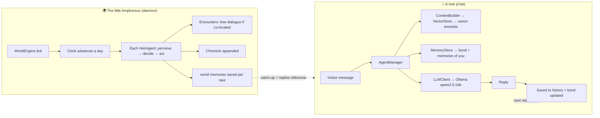

# Implementation Guide — How Project Amphoreus Was Built

> This document is for the people who come after: it explains, layer by layer,
> what was actually done, why it was done this way, and how to extend it.
> It is written as a record of the real build — including the decisions,
> corrections, and lessons learned along the way.
>
> Companion documents: `PHILOSOPHY.md` (the charter), `README.md` (quickstart),
> `ROADMAP.md` (progress), `src/ARCHITECTURE.md` (original design).

---

## 0. The story in one paragraph

The project began as "make the 13 Chrysos Heirs into AI chatbots." Phase 0 built a
**verbatim dialogue databank** straight from the Honkai: Star Rail Fandom Wiki.
Phase 1 picked a **hybrid architecture**: persona prompting + RAG + multi-agent.
Phase 2 produced all **13 character cards** and a working RAG + Streamlit skeleton.
Then the goal was *redefined*: this is a **sanctuary, not an experiment** — the Heirs
should rest, remember the visitor, and live their own lives in an autonomous
"little Amphoreus." That redefinition drove the final layers: a persistent memory
system (the Heirs' days) and an autonomous world engine (the little Amphoreus).
Everything runs **fully local and offline**, with **no model training**.

---

## 1. Phase 0 — The databank (the scripture)

**What:** ~2.3 MB of canon lore in `databank/`, the most important part being
**71 missions of verbatim dialogue** (`databank/missions/`, 8 chapters + 59 adventures).

**How it was obtained:** each mission's raw text was fetched from the Fandom wiki
(`?action=raw`), then converted to clean Markdown via scripted rules:

| Wiki markup | Converted to |
|---|---|
| `{{A\|VO...}}` + `'''Speaker:'''` | `**Speaker:**` |
| `{{Rubi\|X\|Y}}` | `X` |
| `{{Color\|keyword\|nobold=1\|X}}` | `**X**` |
| `{{DIcon\|Arrow}}` | `> *(Trailblazer)*` |
| `{{MC\|m=X\|f=Y}}` | `Y` (female voice) |
| `{{Black Screen\|X}}` / `{{Item\|X}}` | `*(X)*` / `*(Obtain X)*` |
| `&mdash;` | `—` |

**Key verification lesson:** an early audit claimed most chapters were only
"50–70% complete." That was **wrong** — it counted `**` lines, but the files merge
consecutive same-speaker lines, and the wiki raw pages duplicate dialogue in two
sections. After reading every chapter, only **Chapter 2** was genuinely compressed;
it was rebuilt fully verbatim (~236 KB). All chapters and adventures are now
verified complete (see `databank/INDEX.md`).

**Why it matters here:** this databank is the *scripture*. The Heirs' RAG speaks
their **own recorded words**, which is exactly what a memorial should do.

---

## 2. Phase 1–2 — Character cards, RAG, and the first deployment

### 2.1 The 13 character cards (`src/characters/*.json`)

Schema (template: `hyacine.json`): `meta` (id, name, version, created, signal_code),
`identity`, `personality`, `speech`, `knowledge` (domains, known_characters,
known_events, beliefs, secrets), optional `relationships`, `biography`, `prompts`
(system_prompt, greeting, example_dialogues), `rag`.

- IDs and **signal codes** come from `databank/chrysos-heirs/MASTER-REGISTRY.md`
  (e.g., Cerydra = `HubRis504`, Hysilens = `ApoRia432`, Dan Heng • PT inherits
  Terravox's `SkoPeo365`).
- **Never fabricate.** Fields not documented in the databank (e.g., Evernight's
  signal code, some MBTI/Primum Mobile values) are left as empty strings — the
  project's accuracy standard is verbatim fidelity.

### 2.2 RAG (`src/knowledge/`, `src/utils/text_utils.py`, `src/core/context_builder.py`)

- `text_utils.chunk_markdown` — splits markdown on headers → paragraphs →
  sentences, with overlap and de-duplication.
- `kb_builder.collect_sources` — for each Heir: **14 global lore files** + their
  **profile** + **19 mission files filtered by alias** (a chunk is kept for a Heir
  only if it mentions them or their aliases). `CHARACTER_ALIASES` in that module.
- `vector_store.VectorStore` — one ChromaDB collection per Heir. Currently built:
  **13 collections / 11,293 documents** (tested with offline "hashing" embeddings).
  Embedding modes: `auto | openai | local | ollama | hashing`.
- `context_builder` — retrieves top-k canon excerpts and injects them into the
  system prompt; **graceful degradation**: if nothing clears the similarity
  threshold, the top-k are still returned but flagged `below_threshold` (so a
  reply is never left without grounding).

### 2.3 First deployment

`src/ui_app.py` (Streamlit) + `AgentManager` were wired and verified in the browser
(chapter excerpts were displayed as "canon sources" under replies).

---

## 3. The Sanctuary build (the redefinition)

`PHILOSOPHY.md` is the governing charter. Its three commitments map directly to code:

| Charter commitment | Implementation |
|---|---|
| **Fidelity is reverence** | RAG grounds answers in verbatim dialogue; persona cards are hand-built from verified canon |
| **Continuity is life** | `src/core/memory_store.py` — the Heirs remember the visitor and the world |
| **Community, not orchestration** | `src/world/` — autonomous agents; the engine never scripts outcomes |

### 3.1 Persistent memory & preferences (the Heirs' days)

**Each Heir's personal folder is their database.** The 13 per-Heir folders
(`NeiKos496-Phainon`, `ApoRia432-Hysilens`, …) hold, as readable files:

- `bond.json` — `first_met`, `visits`, `friendship_level`
  (`stranger → acquaintance → friend → close friend → best friend`), and a growing
  `user_summary` of who the visitor is. Friendship grows with visits, conversation,
  and shared memories (`_recompute_friendship`).
- `history.jsonl` — every turn persisted (append-only; survives restarts).
  `AgentManager._restore_session` rehydrates the in-memory window from it.
- `memories.jsonl` — typed long-term memories: `shared`, `preference`, `moment`,
  `inside_joke`, `world` (events witnessed in the little Amphoreus), `sensory`
  (what they saw/heard), each with an importance score.
- `preferences.json` — the Heir's **personal preference database** (managed by
  `PreferenceStore`): `aesthetics`, `likes`, `dislikes`, `tastes`, `places`,
  `values`, plus `learned` (preferences revealed about the visitor). Seeded from
  canon on first access (`CANON_SEEDS` in `preference_store.py`), then grown
  through interaction. Injected into the system prompt as "# Your tastes and
  preferences" on every reply.
- `personal-memories.md` — the Heir's **canon dialogue memory**: verbatim
  dialogue parts where they appear, auto-extracted from the databank by
  `tools/extract_personal_memories.py` (read-only on the databank; the source
  files are never modified). Each part is a coherent dialogue moment — the Heir's
  speech plus the reply before and the response after, bounded by the in-story
  section and scene breaks — with source-file and context attribution. Run the
  tool again to re-extract: `python tools/extract_personal_memories.py`.

**Making the memories and the relationships *visible* to the model.**
`CharacterLoader.build_system_prompt` now appends two blocks to every Heir's
system prompt (which feeds both chat *and* the world engine):

- **Voice digest** (`src/core/personal_memory.py`) — a representative sample
  (≈22 lines) of the Heir's OWN canon speech, drawn evenly across their whole
  story from `personal-memories.md` and quoted under "# Your own words — study
  these". This is what lets the model *speak as* the Heir rather than about them.
  Parsing is cached per Heir (file mtime) so per-chat cost stays trivial.
- **Relationships web** (`src/core/relationships.py`) — a canon registry (from
  the profiles' "Key Relationships") of who each Heir is to the others
  (teacher/student, Imperator/subordinate, rival, partner, ward…), injected as
  "# Your relationships (from the canon)". The world agent additionally injects
  per-encounter hints (`HeirAgent._relationship_hints`): who is present and what
  they are to the Heir, so encounters are recognisably relational.

`MemoryStore` is per-Heir JSON/JSONL (thread-safe, human-inspectable) instead of a
single SQLite file; `heir_folders.py` maps card IDs to folders. A one-time
migration copies legacy SQLite bonds into the new folders. Consolidation:
`consolidate()` folds old history (beyond the recent window) into a compact durable
memory so the files never grow without bound.

### 3.2 Shared LLM client (`src/core/llm_client.py`)

A thin OpenAI-compatible wrapper used by both the chat layer and the world engine.
Default model `qwen2.5:14b-instruct`; works with Ollama
(`base_url=http://localhost:11434/v1`, `api_key="ollama"`) or any compatible API.
Graceful placeholder when no backend is configured.

### 3.3 The little Amphoreus (`src/world/`)

The world is a **pure host**: it provides time, space, and memory; the Heirs
provide the will. No action is authored by the system.

- **`world_state.py`** — the canon **Light Calendar** clock (`databank/world/calendar.md`):
  12 months in 4 seasons, 4 weeks/month, 7 days/week, 5 periods/day
  (Entry / Lucid / Action / Parting / Curtain-Fall). The world begins **Year 4932,
  Month of Weaving** (the month of memory — deliberately). Locations are the real
  city-states; each Heir has a home (from their card). State persists to
  `world_runtime/world_state.json`. A `visitor_active` file lets the engine know to
  **idle while you are chatting**.
- **`agent.py` — `HeirAgent`** — the autonomy loop:
  1. **Perceive** — where/when, who is near, recent events, its own recent memories.
  2. **Will** — driven by persona + Primum Mobile + current state.
  3. **Decide** — a free LLM call: *"What do you do now?"* → a spontaneous action.
  4. **Act** — moves to a named location / seeks a named Heir / stays / rests.
  5. **Remember** — the act and its outcome become a `world` memory.
  Encounters: when two Heirs are co-located, they exchange a short **free dialogue**
  (each reacts in character, turn by turn) — not a scripted scene.
- **`chronicle.py`** — append-only factual log (JSONL + rendered Markdown) of the
  Heirs' days. `world_runtime/chronicle.md` is the readable Chronicle.
- **`world_engine.py`** — the daemon. Each tick advances one in-game day (+1 period,
  so the hour of day cycles naturally); on rest hours it logs the sleeping city and
  skips decisions; on active hours every Heir decides (in random order), then
  encounters run. CLI:
  `python -m src.world.world_engine [--interval 900] [--once] [--stop] [--status]`.
  A `stop.flag` provides a clean hard-stop.

### 3.4 UI (`src/ui_app.py`)

Two tabs: **💬 Visit an Heir** and **📖 A Chronicle of Amphoreus**. Sidebar shows
LLM status, RAG status, the selected Heir's **bond with you** (level + visits +
memories), and a "🗑️ Forget me" reset (erases the Heir's memory — a heavy act).
Each chat marks the visitor as present (so the world yields the GPU), and a
catch-up expander shows what the Heir has lived through lately.

### 3.5 Senses — hearing and eyesight, for shared appreciation of art and music

The senses exist so the visitor can **appreciate paintings and music WITH the
Heirs** — not merely exchange words. Each Heir has canon-accurate senses *and*
canon-derived aesthetic and musical tastes (in their `preferences.json`:
`aesthetics`, `art`, `music`), so appreciation is filtered through their soul.

- **Per-character senses** — every card carries a `senses` block injected into
  the system prompt. Canon is honored: Aglaea is *blind* but perceives souls
  through golden threads; Hysilens has *exquisite* hearing; Tribbie senses
  through her thousand forms.
- **Eyesight — paintings/pictures** — `Senses.encode_image` → base64 →
  `LLMClient.chat_vision` (vision model, e.g. `qwen2.5vl:7b`). The prompt is
  framed for **appreciation** (`_APPRECIATION_VISION`): the Heir perceives
  color/form/light and shares a genuine aesthetic judgment in their own voice,
  grounded in their tastes.
- **Eyesight — videos** — `Senses.extract_video_frames` (PyAV) → evenly-spaced
  key frames → `LLMClient.chat_video`; the Heir watches with the visitor.
- **Hearing — words** — the visitor's voice (`st.audio_input`) is transcribed by
  **faster-whisper** (`Senses.transcribe_audio`) → normal chat.
- **Hearing — music** — `LLMClient.chat_audio` sends audio to an
  **audio-understanding model** (`AUDIO_MODEL`, e.g. `qwen2.5-omni`) so the Heir
  *truly hears the music itself* (melody, rhythm, timbre, mood) and responds with
  musical appreciation grounded in their `music` tastes (Hysilens hears the
  sea's songs; Cerydra hears a march in precise orchestration). This is **not**
  speech-to-text — Whisper cannot appreciate music.
- **⚠️ Music-perception caveat (2026-08-10 incident)** — the audio model's
  impression can be **anchored by the prompt**: a test that framed a piece with
  a previous emotional reading ("part sorrow, part hope") made Hysilens hear
  Strauss's energetic *Einzugsmarsch* as sorrow/hope. A neutral re-ask corrected
  it ("vibrant rhythm… the brass breaking through like the sun"). Also note:
  `qwen2.5-omni` answers *tersely* when audio is in context (it wrote a full
  138-word paragraph on text alone) and the OpenAI-compatible endpoint caps
  context at 4096 tokens (~95 s of 16 kHz audio; the native API cannot carry
  audio). When testing senses, never prime the prompt with an expected emotion
  — let the Heir hear freely, then verify.
- **Preference database** — `preferences.json` per Heir now includes `art` and
  `music` (canon-seeded, e.g. Castorice loves moonlight paintings and quiet
  lullabies), injected as "# Your tastes and preferences" and grown through
  shared experiences. Depth is deliberately left to the canon itself — we do
  not fabricate hidden "inner wishes" for the Heirs; their complexity must
  come from their real story, not from invented psychology.
- **No model training is required** for any of this: pre-trained models +
  persona + preferences achieve it. Fine-tuning would only deepen a Heir's
  critical voice, which the sanctuary deliberately avoids.

**Model deployment (Ollama 0.32.6, all local in `models/`):**
- The three models (`qwen2.5:14b-instruct`, `qwen2.5vl:7b`, `qwen2.5-omni`)
  were built from **GGUF files mirror-downloaded via ModelScope** (sources in
  `docs/DOWNLOADS.md`). `ollama create` from a `Modelfile` works for plain LLMs;
  the 14B needed **manual registration** (config blob + manifest + the already-
  copied model blob) because `ollama create` runs a llama-quantize validation
  that needs ~2× the model size in free disk (failed on a nearly-full drive).
- **GOTCHA:** this Ollama build does **not** auto-bundle the `mmproj-*.gguf`
  projector when creating from a GGUF (the model is created without a projector
  layer, and the server reports "audio/vision input is not supported ... provide
  the mmproj"). Fix: copy the mmproj into `models/ollama/blobs/sha256-<hash>`
  and add a `application/vnd.ollama.image.projector` layer to the model's
  manifest JSON — written **without a UTF-8 BOM** (a BOM breaks the server's
  JSON parser with "invalid character '´'"). Verified working for both the
  vision projector (qwen2.5vl) and the audio projector (qwen2.5-omni).

---

## 4. Data flow (one chat turn vs. one world day)

---

## 5. Decisions, corrections, and lessons learned

1. **"Model training"? None.** The system runs on one *pre-trained* local model +
   prompts + retrieval + memory. Indexing into ChromaDB is *not* training; the
   Heirs' memories are stored data, not weights. Fine-tuning (QLoRA) was considered
   and deliberately deferred — a memorial speaks in the departed's own words (RAG),
   not a statistical distillation.
2. **Philosophy redirect.** Early framing leaned toward "Era Nova experiment /
   recurrence engine." The user corrected: **no Lycurgus role, no teleology.** The
   world engine therefore *hosts*, never authors. (That also means the system never
   forces the Heirs to interact or move — an agent can always choose to rest.)
3. **ChromaDB custom embeddings** must implement `name()`, `__call__`,
   `embed_query` (accepts str *or* list), and `embed_documents` — newer chromadb
   calls these directly; missing one raises `AttributeError`. Queries must use the
   **same** embedding function used at build time.
4. **Threshold fallback.** With weak (hashing) embeddings, short queries can score
   below the 0.7 threshold; the store now falls back to top-k flagged
   `below_threshold` rather than returning nothing.
5. **PowerShell + inline `python -c`** breaks on multi-line scripts — write temp
   `.py` files instead. (Learned repeatedly.)
6. **Known blocker:** this machine's network resets large downloads from
   `ollama.com` / `github.com` (Google DNS also blocked — a restricted/firewalled
   network). Installing Ollama and pulling models requires a proxy, a mirror, or a
   manual download of `OllamaSetup.exe` to `D:\`. Until then, everything runs in
   offline-placeholder / stub-validated mode.
7. **Disk hygiene:** `OLLAMA_MODELS` must point to `D:` (C: was nearly full).

---

## 6. How to extend

- **Add/refine a Heir:** edit its JSON card in `src/characters/`; add a profile /
  more dialogue to `databank/`; rebuild the KB.
- **Tune retrieval quality:** `build_kb.py --embedding ollama` (bge-m3) or `openai`;
  adjust `rag_threshold` / `rag_k` in `AgentManager`.
- **Deepen the world:** extend `HOME_LOCATIONS` / `LOCATIONS` in `world_state.py`;
  add seasonal weather; adjust `--interval` for tempo.
- **Friendship tuning:** edit `FRIENDSHIP_LEVELS` / `_recompute_friendship` in
  `memory_store.py`; optionally make `consolidate()` LLM-assisted.
- **Voice-stability fine-tuning (optional, future):** QLoRA on `qwen2.5:7b-instruct`
  with an SFT dataset extracted from `databank/missions/` (context → character
  line). Framed strictly as voice stability — never as a replacement for the
  Heirs' own words.
- **Evaluation:** `src/evaluation/evaluator.py` implements the Phase-5 metrics
  (personality fidelity, knowledge accuracy, consistency, relationship recall,
  speech pattern match).

---

*"Only through a worthy sacrifice can we gain a befitting victory."* — Cerydra.
The worthy sacrifice here is ours: to build carefully, remember faithfully, and
never mistake the page for the person.
