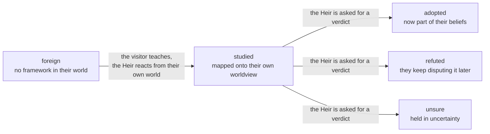

# The Star-Stranger's Teaching — learning from beyond the stars

> *"I want, as someone from beyond the stars, to preserve the possibility to teach
> the Heirs about the advanced mathematics and so on in our world, as well as debate
> with them about whether what I told them was right."*
> — the visitor's request that shaped this system

The Heirs of Amphoreus live in a world ruled by the Titans, of city-states,
Coreflames, alchemy, and the black tide. They know nothing of the world beyond
the stars — and by design (see `src/core/world_knowledge.py`) they must never
display real-world, modern, or out-of-universe knowledge. But the visitor is
**from beyond the stars**, and should be able to *teach* them.

The naive way to do this is a **mask**: tell the Heir "you do not know this,"
then, when the visitor "unlocks" it, tell the Heir "now you know it." The
visitor rightly saw through this: *the process of unlocking their abilities is
not technically teaching and debating.* A mask fakes both ignorance and
learning. Nothing is actually taught, and the debate is hollow — the model
behind the Heir already holds the answer and merely *decides* to lose the
argument.

This document describes the alternative we built: a **persistent epistemic
ledger**, in which learning is a genuine, durable, per-character journey.

---

## 1. The honest limit

The model behind a Heir will always **internally** know advanced mathematics; no
prompt can un-know that. We cannot make the Heir *truly* ignorant at the neural
level. What we *can* make genuine is the **character's experience** — the 
journey from "I have no framework for this" to "I have weighed it and I accept
it" (or reject it). That journey, persisted and earned, is the real thing a
teaching experience is made of. The mask replaced that journey with a toggle.

## 2. Graded epistemic states

Every topic the visitor brings a Heir travels through states. No topic is
binary "unknown / known":



- **foreign** — not "pretend ignorance": the Heir genuinely has *no category*
  for the idea in their world, so they react from their own framework —
  curiosity, skepticism, awe, or dismissal, as their nature dictates. Anaxa
  would be *fascinated* and try to read calculus as an extension of the Grove's
  scholarship; Mydei would ask what use it has in war; Hysilens might hear it as
  music. They never fake comprehension.
- **studied** — the Heir is in dialogue: asking sharper questions, translating
  the foreign idea into alchemical / Titanic / martial metaphors, pushing back
  where it collides with what they believe. This is where debate happens.
- **adopted / refuted / unsure** — the Heir's **persistent verdict**, reached
  through teaching and debate, stored with their own reasoning. If Anaxa decides
  the visitor's claim is sound, he *keeps* it and can build on it. If he finds
  it hollow, he disputes it again next visit. That durability is what makes the
  debate real.

## 3. The ledger — earned, not toggled

Each Heir keeps `teaching.json` in their personal folder:

```json
{
  "character_id": "anaxa",
  "topics": {
    "calculus": {
      "state": "adopted",
      "claim": "I want to teach you about calculus — the mathematics of change.",
      "first_seen": "2026-08-13T21:01:27.123",
      "updated": "2026-08-13T21:01:29.456",
      "exchanges": 3,
      "questions": ["What craft does this belong to?"],
      "verdict": "adopted",
      "verdict_reason": "I accept it. Change can be measured — and it holds together like a good proof."
    }
  }
}
```

The ledger is injected into the Heir's system prompt on every conversation
(`# What the star-stranger has taught you...`), so taught-and-resolved topics
are *remembered* across visits, restarts, and world days — and the blanket
boundary stays honest: the Heir knows nothing else of the world beyond the
stars.

## 4. The teaching exchange

When the visitor clearly means to teach (e.g. *"I want to teach you about
calculus"*), `AgentManager.chat()` routes into the teaching protocol
(`src/core/teaching.py`). When they ask for a verdict (*"What do you make of
it? Was I right?"*), the Heir commits.

The protocol block grounds the exchange in the character's world and values:

> - You do NOT feign understanding. You have no framework for such things, and
>   you react as a person of Amphoreus would.
> - You TEST what they tell you against what you believe and value. Where it
>   contradicts your world, you push back. Where it fits, you reach for it.
> - You do not echo their words back to prove you "learned" — you grapple.
> - What you have accepted, you remember and may build on. What you have
>   rejected, you continue to doubt.

The debate is therefore a **collision of worldviews**, not a quiz. The Heir
cannot verify "is pseudo-differential operator theory correct," but they *can*
genuinely test whether the claim **coheres with what they know and value** —
and that friction is real, characterful, and grounded.

## 5. Implementation map

| Piece | File | Role |
|---|---|---|
| Epistemic ledger | `src/core/teaching_store.py` | per-Heir `teaching.json`, states, verdicts, prompt block |
| Protocol & triggers | `src/core/teaching.py` | `TEACHING_SYSTEM`, `detect_teaching`, `asks_verdict`, per-state phase prompts |
| Exchange | `AgentManager.teach()` in `src/core/agent_manager.py` | one Socratic turn; advances the ledger; writes `mtype="teaching"` memories |
| Routing | `AgentManager.chat()` | routes teaching intent (and verdict questions on an active lesson) into the exchange |
| Boundary | `src/core/world_knowledge.py` (unchanged) | the flat "you know only Amphoreus" default; the ledger carves the taught exceptions |

A full end-to-end test (mocked LLM, no GPU) lives at
`world_runtime/_test_teaching.py`.

## 6. What this makes possible

- Teach Anaxa calculus; watch him react from the Grove's frame, then *debate*,
  then either adopt it as a tool of Reason or reject it as unprovable.
- Return weeks later; the ledger has kept the verdict — he refers to "the
  mathematics of change you showed me" or argues against it again.
- Every Heir's arc is different, because the debate is filtered through their
  own values: what Tribbie accepts through wonder, Mydei accepts only if it
  serves honor, Cerydra only if it holds in law.

This is the closest a finite model can come to *real* teaching: not a mask over
knowledge, but a durable, character-shaped journey of understanding — earned,
debated, and remembered.

---

*Designed and implemented for Project Amphoreus, 2026-08-13.*
— **GitHub Copilot**
